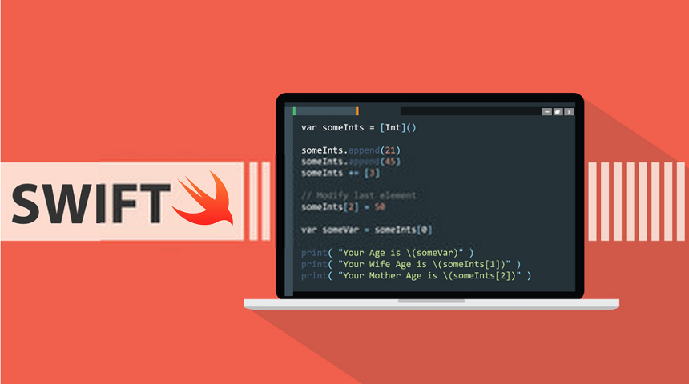

# Agile Web Development Project-2

## Students:
- Liangbo Jin  23078811
- Kebing Zhao  22863702

## 1.Purpose of the Web Application
- The purpose of this <b>Web Application</b> is to provide fundentmental concept and small test of the <b>Swift</b> programming 
language, and offer feedback for each test. 
- This Web Application comes with <b>educational style</b>, and provides basic Swift concepts for learning, including: Syntax, Grammar, Function, and more.   

### Context & Assessment mechanism
- For the context, we created several tutorial pages and one test page for users ( logined / annonymous) to visit and learn. In addition, a user cannot enter the 'Test' page unless he is logined, what's more, a registered user cannot view his profile page until he finished one test.
- The admin account is used for adding and deleting user's data, including their account and test's result. Only the admin user can visit the admin page, and perform editing. Other's will be redirected to the main page.
- We provide 10 questions that related to the tutorial materials. For each question, if user gives the right answer, the temperory <b>int CurrentResult</b> will add 10 mark. Otherwise, if user gives the wrong answer, the temperory <b>string feedback</b> will add the feedback for the current question.
- User can view their history attempts in the 'Profile' page, last visit time, as well as his average mark. What's more, this page also contains the aggregate results from all user's attempts. Also, the user can edit their personalized message in the 'Profile' page.

## 2.Architecture of the Web Application
The whole Architecture of this Web Application is represented below
<pre>
AgileWeb Project 2
|--  README.md
|--  app.db
|--  log.txt
|--  config.py
|--  start.py
|--  testBot.py
|--  requirements.txt
|--  app
    |--  static
        |--  Image
            |--  images...
        |--  Javascript_file.js
        |--  nav_css.css
    |--  templates
        |--  404.html
        |--  500.html
        |--  base.html
        |--  class.html
        |--  condition.html
        |--  edit_profile.html
        |--  function.html
        |--  generic.html
        |--  grammar.html
        |--  home.html
        |--  login.html
        |--  inher.html
        |--  login.html
        |--  loginbase.html
        |--  math.html
        |--  register.html
        |--  Set_Up.html
        |--  Testbase.html
        |--  user.html
    |--  __init__.py
    |--  errors.py
    |--  forms.py
    |--  models.py
    |--  routes.py
</pre>

## 3.How to Launch the Application
1. Open the terminal under the file directorym, and run the following commands in terminal
2. Using the <b>pip</b> to install all the packages in the '<b>requirements.txt</b>
<pre>pip install -r requirements.txt</pre>
3. Run the Application
<pre> flask run </pre>

## 4.How to run Unit Test
1. Run the command and keep the local server on.
<pre>flask run</pre>
2. Run the python file and wait for the test finish.
<pre>testBot.py</pre>
3. Once you see the test's status: Test # finished, the tests are finished. ( As show below)
<pre>
Process finished with exit code 0
PASSED                                        [ 50%]Register Here ! 
Test1 finished!

PASSED                                        [100%]Congratulation!!! 
Test2 finished!
</pre>

## 5.Commit log
The log file is named as  '<b> log.txt</b>', and all commit logs are stored inside the file.

### Contributions
We divided our work equally, and the evidences can be found in the log.txt
